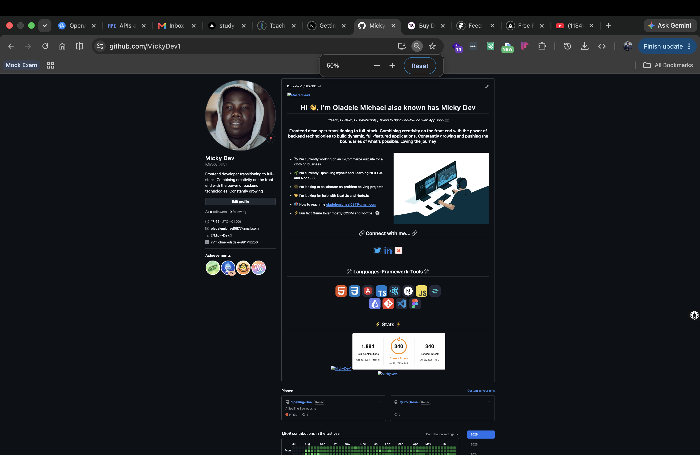

  

<h1 align="center">Hi 👋, I'm Oladele Michael, also known as Micky Dev</h1>

<h3 align="center">
  Frontend developer transitioning into full-stack development.
</h3>

  <strong>React.js • Next.js • TypeScript</strong> 
  I build clean, responsive front-end experiences while growing my backend skills with Node.js and modern full-stack tools.

  
  
  

<table>
  <tr>
    <td width="58%" valign="top">
      <h3>About Me</h3>
      <ul>
        <li>🔭 I'm currently building an e-commerce website for a clothing business.</li>
        <li>🌱 I'm upskilling in <strong>Next.js</strong>, <strong>Node.js</strong>, and full-stack application development.</li>
        <li>👯 I'm open to collaborating on problem-solving projects.</li>
        <li>🤝 I'm looking for help with <strong>Next.js</strong> and <strong>Node.js</strong>.</li>
        <li>📫 Reach me at <strong>oladelemichael587@gmail.com</strong>.</li>
        <li>⚡ Fun fact: I enjoy CODM and football.</li>
      </ul>
    </td>
    <td width="42%" valign="top">
      
    </td>
  </tr>
</table>

---

<h2 align="center">🛠️ Languages, Frameworks & Tools</h2>

  

---

<h2 align="center">⚡ GitHub Stats</h2>

  
  
   
  

